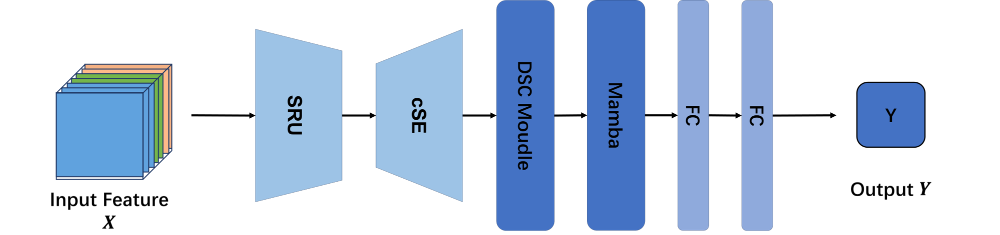
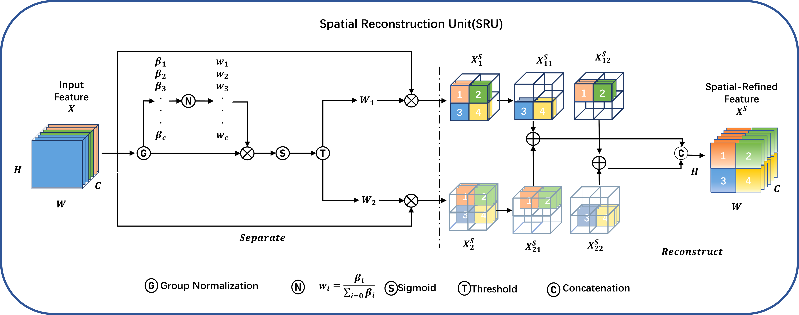

# A Mamba-Enhanced Spatial-Channel Cross-Recombination Temporal Network using 4D Feature Flow in EEG Signals

ABSTRACT
Emotion recognition electroencephalography has been applied to the Braincomputer-powered medical product interface BCI, which supports various medical activities with existing medical diagnostics. However, its development is limited by the difficulty of multi-dimensional analysis of space-channel-temporal. To address this problem, this paper proposes a Mamba-Enhanced Spatial-Channel Cross-Recombination Temporal Network (SCM-NET). A 4D EEG signal that has undergone DE cross-entropy is used as input. Firstly, the attention mechanism module is used to segment and reorganize spatial and frequency band signals according to different threshold sizes. Second, the DSC network is used to highlight the most valuable information features of space and frequency bands for information fusion. Finally, the high-level time information features were extracted based on the Mamba network. We evaluated its performance using DEAP, MEEG, SEED, and SEED-VIG datasets and achieved recognized accuracy rates of 71.5\%, 97.1\%, 88.3\%, and 99.86\%, respectively, which outperformed the current state-of-the-art technology compared to existing methods.

<!-- PROJECT LOGO -->
<br />

<p align="center">
  <a href="https://github.com/NicoleRR2001/SCM-NET/">
    
    
  </a>


 本篇README.md面向开发者
 
## Contents

- [Requirements](#Requirements)
- [File and folder contents](#File-and-folder-contents)
- [Quick start](#Quick-start)
- [如何参与开源项目](#如何参与开源项目)


### Requirements
In the folder path, use command to the terminal, install the dependency package.

```sh
pip install -r requirements.txt
```
It contains the following packages.


```sh
numpy==1.19.5
scikit_learn==1.0.2
scipy==1.5.4
torch==2.0.1
visdom==0.1.8.9
triton==2.3.1
transformers==4.43.3
causal-conv1d==1.4.0
mamba-ssm==2.2.2
```

### File and folder contents

```
filetree 
├── ARCHITECTURE.md
├── LICENSE.txt
├── README.md
├── requirements.txt
├── Model.py
├── train.py
├── DE_3D_Feature.py
├── DE_4D_Feature.py
├── /processedData/
│  ├── label.npy
│  ├── data_3d.npy
│  └── data_4d.npy
├── /pth/
│  ├── label.npy
│  ├── data_3d.npy
│  └── data_4d.npy
```

1.DE_3D_Feature.py : Convert raw EEG data of 23 subjects to 3D features.
2.DE_4D_Feature.py : Convert 3D features into 4D features according to the 2D topographic map (refer to the paper).
3.dataloader : Divide the four-dimensional features and dataset labels into training set (4/5) and test set (1/5) according to the custom five-fold cross-validation.
4.train : training and testing, the training curve can be displayed in real time on the web page through visdom.
5.Model : the defined SCM-NET model.
6."./processedData/" : used to store the converted 3D features and 4D features.
7."./pth/" : used to store the model with the highest accuracy in the nth fold training.

### Quick start
1. open "SCM-NET/DE_3D_Feature", change the path of dataset and run it, get the result "SFT-Net/processedData/data_3d.npy"
2. open "SCM-NET/DE_4D_Feature", run it directly, and get the result "SFT-Net/processedData/data_4d.npy"
3. Open "SFT-Net/dataloader", you can adjust the number of folds in the five-fold cross-validation for verification, set batch_size, or set a random number seed.
4. Open "SFT-Net/train",before train, you need to enter

```sh
python -m visdom.server
ssh -L 8097:127.0.0.1:8097 lizr@10.193.0.206:22
```
In the same time, open the website in the prompt for real-time visualization. You can adjust the learning rate or Epoch yourself.


#### 如何参与开源项目

贡献使开源社区成为一个学习、激励和创造的绝佳场所。你所作的任何贡献都是**非常感谢**的。


1. Fork the Project
2. Create your Feature Branch (`git checkout -b feature/AmazingFeature`)
3. Commit your Changes (`git commit -m 'Add some AmazingFeature'`)
4. Push to the Branch (`git push origin feature/AmazingFeature`)
5. Open a Pull Request
